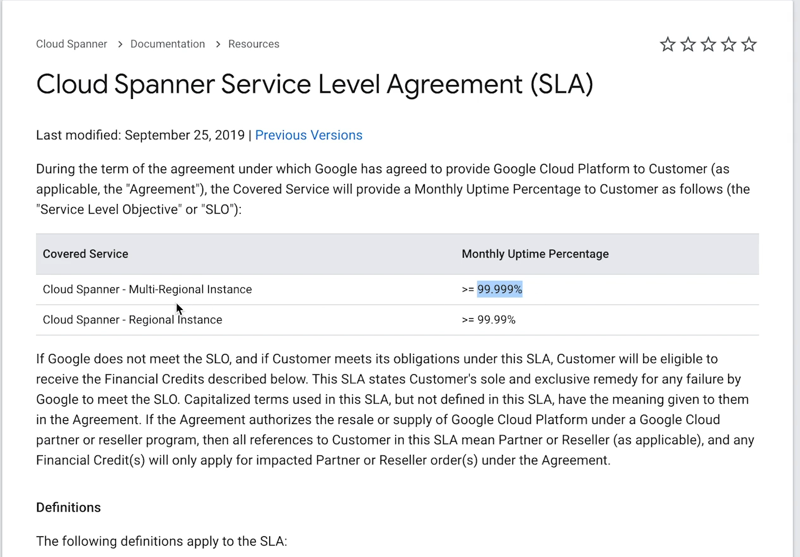

**Availability**

 One way to think about it is how resistant the system is w.r.t failures. Often described as 
 fault tolerant. Another way to think about it is in a given amount of time(1 month) how long
 it was able to do its primary job. 
 
  Example. Leetcode, when you purchase leetcode you are purchasing access to content and ability
  to watch video. So there is an implied guarantee comes with leetcode, you expect the website 
  to be fully operational. If its not fully operational then you wont be happy.
  
So for the designers of the leetcode availability matters, because here we can loose customers,
might get bad reviews.. so we need to take care of this implied guarantee of availability.
There are varying kind of availability. For ex. Leetcode if its not operational for 1 hour
its not a big deal but think about an airplane software, if that system were ever go down then 
that would be absolutely unaccepatable. You would expect high amount of availability in this 
kind of systems(Life or death). Another is YouTube. If YouTube ever goes down its really bad,
take cloud providers. If parts of this cloud providers ever go down it will affect a log of customers.

GCP had an outage for few hours, and vimeo affected by it. This meant that people on LeetCode
cant watch vimeo videos, and it will have an ripple effects. All that to say availability matters 
a lot.

**So how do we meassure..?**

We tipically we meassure the percentage of availability / year.

50% of the time if the website was operations. - Its very Bad!

We are usually dealing with very high numbers when it comes to availability. We often end up
messuring availability in terms of nines(9). If you have a system which has 99% availability.
In the industry we say we have two nines availability.

If yous system has 99.9 % - 3 nines of availability.
                   99.99%  4 nines of availabililty.

availability is really important and it matters to both sys designers and end users.
Many providers will have SLA(Service Level Agreement)  : - it is an agreement between
service providers and customers, many service providers will have explicit written SLA.
it says we guarantee you this SLA. (SLO is is used synonimously but its wrong and its not same. 
It is Service Level Objective).  
All these major cloud providers have very clear cut SLA. We can see them online. These are very
important when buying services.

The below is SLA of Cloud Spanner Database

In this it says what happens it failed to meet the availability. It basically says 
about paying back to customers, it is a very important and very serious. Eventhough availability
is important is not always needed, the point is ensuring high level of availability has
lot of tradeoffs, like high latency or low throughput. As s sys designer we should 
decide which part of the system should be highly available.

Take an example, Stripe. There core services like handling payments - this service should be highly available.
                          They have a dashnoard that business to monitor their payment info. That dashboard if goes down its not 
                          really as bad as the core service.

As a sys designer we must think about what part of the system can go down, what part should be highly available.

##You want to make sure there is no single points of failures in your system.

How do you make sure there is no single points of failure ..?  Redundancy..

If there is a single server and if it gets overloaded then if it goes down that would become a single point of failure. 

You can put multiple instances and have a load balancer, ok now the load balancer is a single point of failure. 
 
We can even make redundant load balancers, we can bring redundancy just by bringing machines into the component.
These are called passive redundancy - If any point in time if one serivce goes down nothing will happen.
Ex: Airplane engine. An airplane will have two engines, if one engine broken it can work with just one engine.

Active Redundancy : When you have multiple machines that works together in such a way that only one or two machine tipically handles traffic/ doing work. If it 
fails the other machine somehow knows that the other one failed and it will take over.

