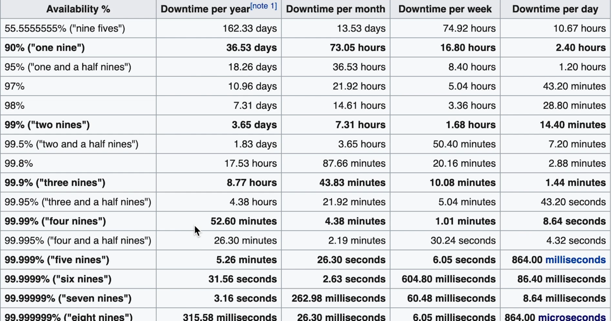

**Availability**

 One way to think about it is how resistant the system is w.r.t failures. Often described as 
 fault tolerant. Another way to think about it is in a given amount of time(1 month) how long
 it was able to do its primary job. 
 
  Example. Leetcode, when you purchase leetcode you are purchasing access to content and ability
  to watch video. So there is an implied guarantee comes with leetcode, you expect the website 
  to be fully operational. If its not fully operational then you wont be happy.
  
So for the designers of the leetcode availability matters, because here we can loose customers,
might get bad reviews.. so we need to take care of this implied guarantee of availability.
There are varying kind of availability. For ex. Leetcode if its not operational for 1 hour
its not a big deal but think about an airplane software, if that system were ever go down then 
that would be absolutely unaccepatable. You would expect high amount of availability in this 
kind of systems(Life or death). Another is YouTube. If YouTube ever goes down its really bad,
take cloud providers. If parts of this cloud providers ever go down it will affect a log of customers.

GCP had an outage for few hours, and vimeo affected by it. This meant that people on LeetCode
cant watch vimeo videos, and it will have an ripple effects. All that to say availability matters 
a lot.

**So how do we meassure..?**

We tipically we meassure the percentage of availability / year.

50% of the time if the website was operations. - Its very Bad!

We are usually dealing with very high numbers when it comes to availability. We often end up
messuring availability in terms of nines(9). If you have a system which has 99% availability.
In the industry we say we have two nines availability.

If yous system has 99.9 % - 3 nines of availability.
                   99.99%  4 nines of availabililty.

